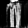
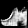
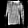

# Fashion-MNIST GAN

This project implements a **Generative Adversarial Network (GAN)** trained on the **Tensorflow [Fashion-MNIST](https://www.tensorflow.org/datasets/catalog/fashion_mnist?hl=pl) dataset**. 

The goal of this project is to train a model to create realistic images of clothing items such as shirts, shoes, and bags etc. I saw a part of this project in a youtube video few weeks ago - and decided to give it a go myself.

---

## 🧠 What is a GAN?

A **Generative Adversarial Network (GAN)** is a deep learning architecture introduced by Ian Goodfellow in 2014.  
It consists of two neural networks that compete against each other:  

- **Generator** – learns to produce synthetic data (e.g., images) that mimic real data.  
- **Discriminator** – learns to distinguish between real data and synthetic data created by the generator.  

Through this adversarial process, the generator gradually improves at creating realistic samples, while the discriminator becomes better at spotting fakes.  
The result is a powerful framework capable of generating highly realistic images, audio, and other types of data.

---

## 📌 Project Overview
The notebook walks through the full pipeline of building and training a GAN:
1. **Importing dependencies** – TensorFlow, TensorFlow Datasets, Matplotlib.
2. **Loading and visualizing data** – Fashion-MNIST images.
3. **Building the Generator** – a neural network that creates synthetic images.
4. **Building the Discriminator** – a neural network that distinguishes real from fake images.
5. **Training the GAN** – adversarial training of the generator and discriminator.
6. **Visualizing results** – generated samples at different epochs.

---

## 🧩 Model Architecture
- **Generator**
  - Fully connected and convolutional transpose layers.
  - Uses ReLU activations and Sigmoid output for normalized images.
- **Discriminator**
  - Convolutional layers with LeakyReLU activations.
  - Outputs a single probability value (real vs fake).
- **Loss Function**
  - Binary cross-entropy.
- **Optimizer**
  - Adam optimizer with tuned learning rates.

---

## 📊 Dataset
- **Fashion-MNIST**: 70,000 grayscale images (28x28 pixels).
- Categories: T-shirt/top, trouser, pullover, dress, coat, sandal, shirt, sneaker, bag, ankle boot etc.

---

## ⚙️ Installation

1. Download the .ipynb file
2. Open in Jupyter Lab, Google Colab or other environment supporting this kind of files
3. You can either watch my outputs in file, or run a file cell by cell yourself!

---

## 🔍 Results

After training the model through 100 epochs (recommended would be around 2000), the generator is able to partially create recognizable fashion items. This repository contains both trained generator and discriminator, 

The accuracy and diversity of the output would be better if the model was trained through more epochs, but 100 epochs took my computer almost an entire day ;-; it would take moreless a week for my laptop to walk through 2000 epochs, so please keep that in mind ;)

Images improve in quality as training progresses. Here are some examples of images generated by the model during last couple of epochs:

  

---

